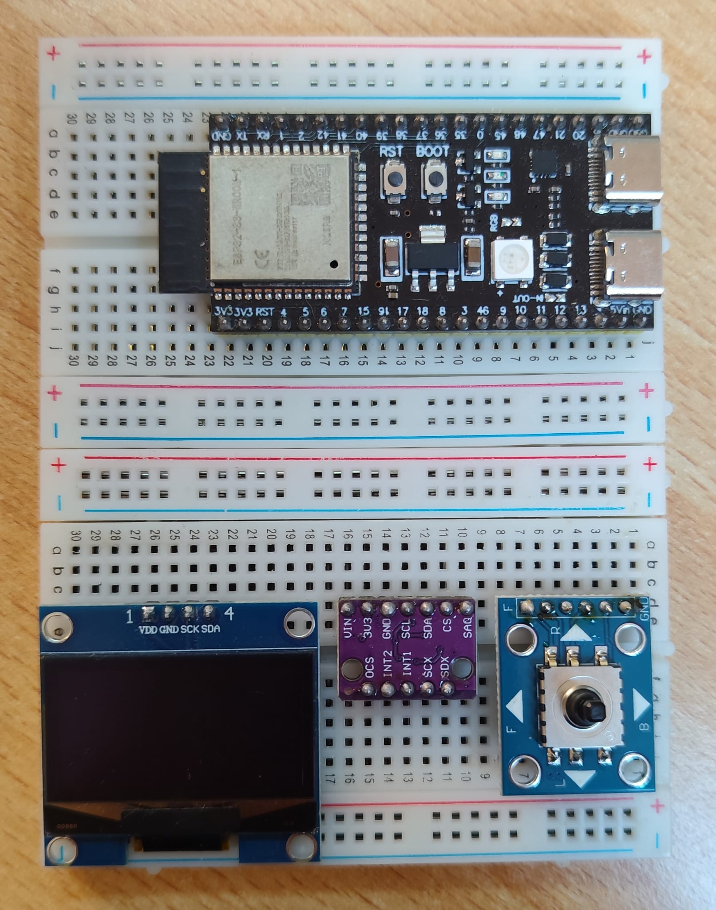

# FocusDock — Focus & Availability Device

A small desk gadget that protects your focus time. It sits on your desk as a
phone dock, or clips onto the top or bottom edge of your monitor. One glance
tells you (and everyone walking by) what's going on:

- **Focus timer** — press up/down to pick the minutes, click to start. The
  screen counts down.
- **Status light** — LEDs glow **green** (free), **amber** (busy / in a
  meeting), or **red** (focusing — do not disturb). The color follows the
  timer automatically, or you can set it yourself with one click: an instant
  meeting indicator.
- **Phone dock** — park your phone on it and out of your hands. (Auto-detect
  of a docked phone is on the [roadmap](#roadmap).)
- **Mounts either way up** — clip it to the top or bottom monitor edge; the
  screen flips itself the right way up automatically.
- **Settings over Wi-Fi** — the device broadcasts its own Wi-Fi hotspot. Join
  it from your phone and open a simple web page to change brightness, default
  timer length, and more. No app to install.

## The prototype today

Everything below is running on a breadboard right now:



**Working:** display, motion sensor, auto-flip, LED strip, the focus timer,
manual status override, and the Wi-Fi settings page.
**Not built yet:** phone-presence sensing, enclosure, proper 5V LED power —
see the [roadmap](#roadmap).

## How to use it

The 5-way button does everything:

| Button | When idle | While running | While paused |
|---|---|---|---|
| **Up / Down** | Set the minutes (±5) | — | Down = cancel session |
| **Click** (center) | Start the timer | Pause | Resume |
| **Left / Right** | Cycle the status light: auto → free → busy → focus → auto (works anytime) |

When the timer hits zero the LEDs blink green and the screen shows *Done!* —
click to dismiss (or it clears itself after a minute).

**Changing settings:** on your phone, join the Wi-Fi network **FocusDock**
(password `focus1234`), then open **http://192.168.4.1** in a browser. Change
what you like, press Save — settings persist across power-off.

## What's inside

| Part | Job | ~Price |
|---|---|---|
| ESP32-S3 board (WROOM-1 N16R8) | The brain — runs everything, provides Wi-Fi | €14.49 |
| 1.3" OLED display (128×64, I2C) | Timer and menus | €7.19 |
| BMI160 motion sensor | Detects which way up it's mounted | ~€5 |
| WS2812B LED strip | The status light | €3.89 |
| 5-way button (5DirKey) | All input | ~€1 |

Full wiring instructions, circuit diagram, and part gotchas:
**[docs/HARDWARE.md](docs/HARDWARE.md)**.
New to electronics? Every concept this project uses, explained briefly:
**[docs/ELECTRONICS.md](docs/ELECTRONICS.md)**.

## Build & flash the firmware

You need [Python 3](https://www.python.org/downloads/) and a USB-C cable.
Everything else installs itself.

1. **Plug in the board** and find its port:
   ```
   make ports
   ```
   Yours is one of the `usbmodem*` entries (not `Bluetooth-Incoming-Port` or
   `debug-console`). The board has two USB-C ports — if one doesn't respond,
   try the other. macOS can rename the port across reconnects, so re-check if
   an upload suddenly can't find it.

2. **Flash:**
   ```
   make flash PORT=/dev/cu.usbmodemXXXX
   ```
   The first run installs PlatformIO and downloads the toolchain (~2 min,
   one-time). It then uploads the firmware and opens the serial monitor so you
   can watch the device's log output. `Ctrl+C` exits the monitor.

Other targets: `make build`, `make upload`, `make monitor`, `make clean`.

**If upload hangs at "Connecting..."**: hold **BOOT**, tap **RESET**, release
**BOOT**, retry. If it fails partway with a checksum error, that's a flaky USB
connection — reseat the cable and retry.

### Test firmwares

Besides the main firmware there are three small test builds for checking the
hardware piece by piece — useful after wiring changes:

| `ENV` | What it checks |
|---|---|
| `esp32-s3` *(default)* | The real firmware — everything |
| `test-bringup` | I2C scan + display + IMU readout: is everything wired and answering? |
| `test-orientation` | Just the display auto-flip |
| `test-orientation-led` | Auto-flip + LED color change |

Flash one with e.g. `make flash ENV=test-bringup PORT=...`.

## Tweaking the firmware

Every tunable number lives in one clearly-marked **CONFIG block** at the top
of [`src/main.cpp`](src/main.cpp): pin assignments, colors, timer defaults,
thresholds, Wi-Fi name/password. Change a value, `make flash`, done.

Project layout:

```
src/main.cpp        the firmware (CONFIG block on top)
src/test_*.cpp      hardware test builds
platformio.ini      build configuration (one env per firmware)
Makefile            build/upload/monitor shortcuts
docs/HARDWARE.md    parts, wiring, circuit diagram
docs/ELECTRONICS.md electronics concepts, briefly explained
```

## Roadmap

What it takes to go from breadboard to a product with a long life:

**Hardware**
- [ ] Move LED strip to proper 5V power + 74AHCT125 level shifter + 1000 µF cap
- [ ] Presence sensor for the phone dock (IR / light / pressure — pick one)
- [ ] USB-C power breakout with Schottky diode (safe dual-power)
- [ ] Scale to the full 20-30 LED ring on a 5V/3A supply
- [ ] Enclosure + monitor clip design (3D-printed first)
- [ ] Evaluate rotary encoder vs. 5-way button for the final feel
- [ ] Custom PCB once the design settles

**Firmware**
- [ ] Dock/undock actions (auto-start focus session when phone is docked)
- [ ] Colors and more settings editable from the Wi-Fi page
- [ ] Wi-Fi client mode + NTP so the idle screen can show a clock
- [ ] Calendar integration (busy light follows your meetings automatically)
- [ ] Optional buzzer/chime when the session ends
- [ ] Over-the-air firmware updates (no cable needed)
- [ ] MQTT / Home Assistant integration
- [ ] Factory-reset gesture (e.g. hold click 10 s)

**Product**
- [ ] Session stats (focus minutes per day/week)
- [ ] Battery option + deep sleep for cable-free desks
- [ ] User-test with non-technical people; simplify anything they stumble on

## License

See [LICENSE](LICENSE).
