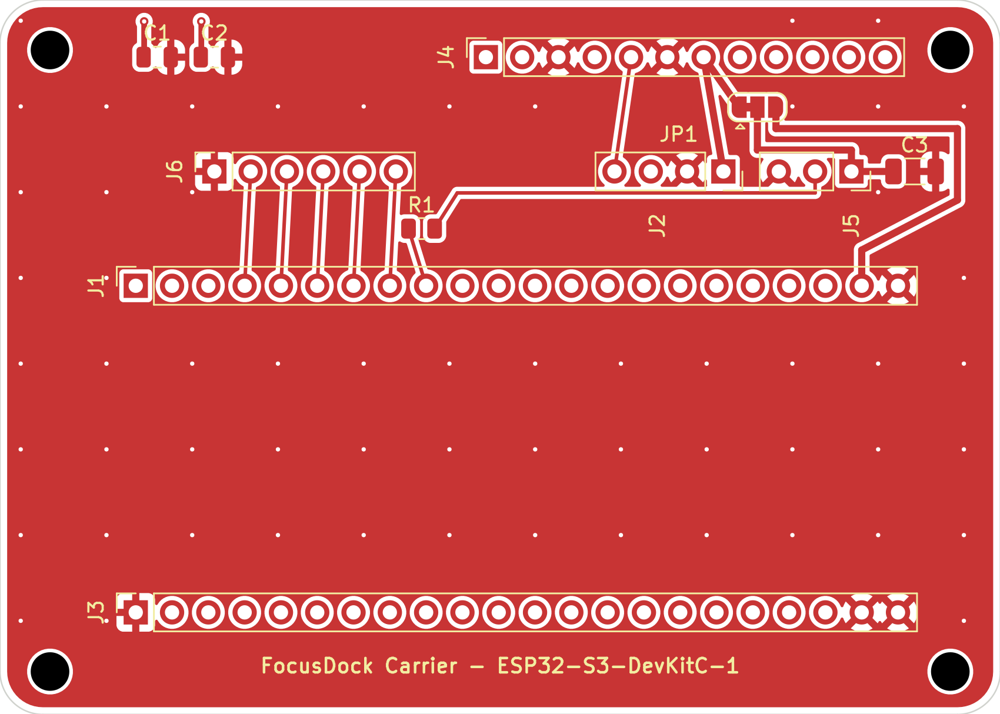

# FocusDock Carrier Board

A two-layer carrier PCB that replaces the breadboard wiring in
[`docs/HARDWARE.md`](../../docs/HARDWARE.md). It carries **no bare ICs** — the
ESP32-S3 devkit, OLED, IMU, LED strip and 5-way button all stay as modules and
plug into headers. The board is just the wiring, plus the one passive the
electronics doc asks for (the LED series resistor) and rail decoupling.

Open `focusdock-carrier.kicad_pro` in KiCad 8 or newer (built with 10.0.5).

| | |
|---|---|
| Size | 70 × 50 mm, 3 mm corner radius |
| Layers | 2 (F.Cu / B.Cu), GND pour on both, 59 stitching vias |
| Mounting | 4 × Ø2.7 mm (M2.5), corners |
| Trace widths | 0.25 mm signal, 0.5 mm power |
| ERC | 0 errors, 0 warnings |
| DRC | 0 errors, 0 unconnected pads |



## How the devkit mounts

The ESP32-S3-DevKitC-1 has no bundled KiCad footprint, so it is modelled as
**two 1×22 female sockets** (J1 / J3) that the devkit plugs into like a shield.
The spacing is not a guess — it was measured from Espressif's own mechanical
DXF (`DXF_ESP32-S3-DevKitC-1_V1.1_20220429.dxf`):

| Measurement | Value |
|---|---|
| Header row pitch (J1 ↔ J3) | **22.86 mm** (0.900 in) |
| Pin pitch | 2.54 mm |
| Pins per row | 22 |
| Devkit outline | 62.74 × 25.40 mm |
| Devkit drill | Ø1.02 mm |

Pin 1 of both rows is at the **antenna** end; the USB ports are at the pin-22
end. The devkit body spans roughly x 21.5–84.3, y 38.7–64.1 on this board, so
every peripheral connector sits *above* it and stays reachable once the devkit
is seated.

## Connectors

Pin 1 is the square pad on every header. Full legend is also printed on the
back silkscreen.

| Ref | Part | Pins (1 → n) |
|---|---|---|
| **J1** | Devkit socket, row J1 | `3V3 3V3 RST 4 5 6 7 15 16 17 18 8 3 46 9 10 11 12 13 14 5V G` |
| **J3** | Devkit socket, row J3 | `G TX RX 1 2 42 41 40 39 38 37 36 35 0 45 48 47 21 20 19 G G` |
| **J2** | OLED, 1×4 | `VDD GND SCK SDA` |
| **J4** | BMI160 IMU, 1×12 | `VIN NC GND SCL SDA SA0 CS NC NC NC NC NC` |
| **J5** | WS2812B strip, 1×3 | `VDD DIN GND` |
| **J6** | 5DirKey V1-2, 1×6 | `GND F B L R CLICK` |

`J6` pins are named by the button module's **physical silkscreen** (F/B/L/R),
not the logical directions the firmware uses — `buttonsPoll()` in
`src/hardware/buttons.h` does that remap. See the button-mapping section of
[`CLAUDE.md`](../../CLAUDE.md).

## Net map

Matches the wiring table in `docs/HARDWARE.md` pin for pin.

| Net | Devkit pin | Goes to |
|---|---|---|
| `+3V3` | J1/1, J1/2 | J2/1, J4/1 (VIN), J4/7 (CS, tied high for I2C mode), JP1/1, C1, C2 |
| `GND` | J1/22, J3/1, J3/21, J3/22 | pour → every module ground, J4/6 (SA0 → 0x68) |
| `I2C_SDA` | J1/12 (GPIO8) | J2/4, J4/5 |
| `I2C_SCL` | J1/15 (GPIO9) | J2/3, J4/4 |
| `LED_DATA` | J1/9 (GPIO16) | R1 (330 Ω) |
| `LED_DIN` | — | R1 → J5/2 |
| `LED_VDD` | — | JP1/2 → J5/1, C3 |
| `+5V` | J1/21 | JP1/3 |
| `BTN_F` | J1/4 (GPIO4) | J6/2 |
| `BTN_B` | J1/5 (GPIO5) | J6/3 |
| `BTN_L` | J1/6 (GPIO6) | J6/4 |
| `BTN_R` | J1/7 (GPIO7) | J6/5 |
| `BTN_CLICK` | J1/8 (GPIO15) | J6/6 |

`J4/2` (the BMI160 breakout's `3V3` pin) is deliberately left unconnected — it
is the module regulator's *output*, and driving it is the mistake
`docs/HARDWARE.md` warns about. All other IMU aux pins (INT1/INT2/OCS/SCX/SDX)
are unconnected too, as are the 19 devkit GPIOs the firmware doesn't use.

## JP1 — LED supply selector

`docs/HARDWARE.md` runs the WS2812B at 3.3 V for bring-up but notes 5 V is the
real spec. JP1 makes that a solder-jumper choice instead of a board respin:

```
  +3V3  1 ──┐
            ├── 2  LED_VDD  →  J5/1, C3
   +5V  3 ──┘
```

Ships with **1–2 bridged (3.3 V)**, matching the current firmware and docs. To
move to 5 V, cut the 1–2 bridge and solder 2–3 — and read the power note in
`docs/HARDWARE.md` first: at 5 V the 3.3 V data line is marginal and wants the
74AHCT125 level shifter that is still on the roadmap.

## Files

```
focusdock-carrier.kicad_pro/.kicad_sch/.kicad_pcb   the project
export/                                            SVG + PNG previews
fab/gerbers/                                       gerbers + Excellon drill
fab/focusdock-carrier-bom.csv                      BOM
fab/focusdock-carrier-pos.csv                      pick-and-place
```

`fab/` is generated output — regenerate it from the project rather than
editing it.

## Before you order

- **Verify the J4 pin order against your actual BMI160 breakout.** The board is
  wired for the common GY-BMI160 12-pin order listed above. Breakouts sold under
  the same name do vary; a mismatch makes that one connector wrong.
- The four `MountingHole_2.7mm` DRC warnings ("does not match copy in library")
  are cosmetic — the footprints were created as local variants.
- No enclosure dimensions were available, so the outline is a plain rounded
  rectangle sized to the devkit. The monitor-clip / phone-dock mechanics in the
  README roadmap are not accounted for.
